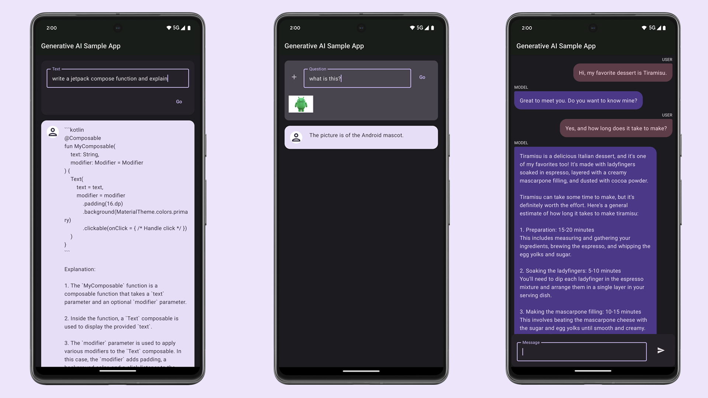

# Google Generative AI Sample App Enhancement: News Articles Feature

This update introduces a new feature to the existing Google Generative AI Sample app. The "News Articles" section now displays a list of the latest editorials from The Hindu newspaper, sourced via an RSS feed. Users can view the full content of each article through web scraping and generate summaries using the Gemini "gemini-1.5-flash-latest" model. This enhancement offers a seamless way to stay informed with editorial content and quickly understand key points through AI-generated summaries.

## Original Readme 
[Google AI SDK for Android Github Link](https://github.com/google-gemini/generative-ai-android)

This Android sample app demonstrates how to use state-of-the-art 
generative AI models (like Gemini) to build AI-powered features and applications.

To try out this sample app, you need to use latest stable version of Android Studio. 
However, if you want to latest lint checks and AI productivity features in Android 
Studio use the latest preview version of [Android Studio](https://developer.android.com/studio/preview).

You can clone this repository or import the project from Android Studio following the steps
[here](https://developer.android.com/jetpack/compose/setup#sample).

## Screenshots



## Requirements

1. Follow the instructions on Google AI Studio [setup page](https://makersuite.google.com/app/apikey) to obtain an API key.
2. Add your API Key to the `local.properties` file in this format

```txt
apiKey=YOUR_API_KEY
```
## Features

This sample showcases the following API capablilites:
* Generate Text - demonstrates the Text feature from the SDK
* Photo Reasoning - demonstrates the MultiModal feature from the SDK
* Chat - demonstrates the Multi-turn Conversations feature from the SDK

## Documentation

You can find the quick start documentation for the Android Generative AI API [here](https://ai.google.dev/tutorials/android_quickstart).
